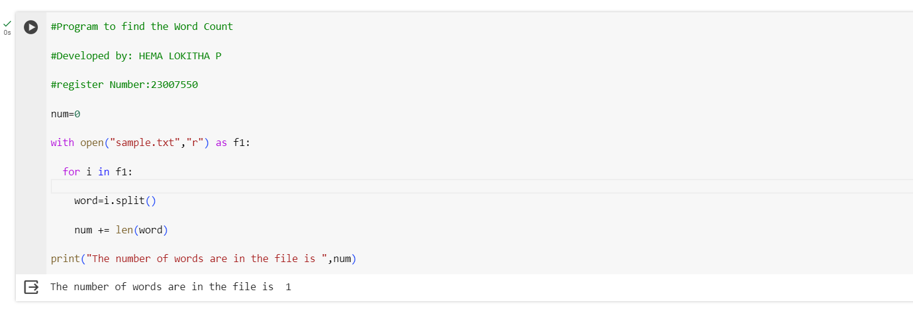

# Word-count
## AIM:
To write a python program for getting the word count from a text.
## EQUIPEMENT'S REQUIRED: 
PC
Anaconda - Python 3.7
## ALGORITHM: 
### Step 1:
Import numpy as np
### Step 2: 
 Enter the input values
### Step 3: 
write a python program for getting the word count from the contents of a file using command line arguments
### Step 4:  
Run the program
### Step 5: 
input the values
### Step 6: 
End the program
## PROGRAM:

```
#Program to find the Word Count

#Developed by: HEMA LOKITHA P

#register Number:23007550

num=0

with open("sample.txt","r") as f1:

  for i in f1:

    word=i.split()

    num += len(word)

print("The number of words are in the file is ",num)
```
### OUTPUT:



## RESULT:
Thus the program is written to find the word count from a text.
